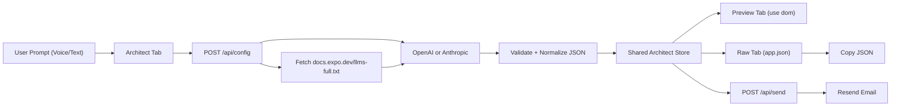

# Expo Architect

Expo Architect is a PWA-first, Expo SDK 55 demo that turns natural language requirements into a validated `app.json`, shows a live visual preview, and optionally emails the config to your inbox.

It is designed as a high-signal DevRel project around Expo's AI-doc readiness (`llms-full.txt`) and modern Expo Router workflows.

## Demo Flow

1. Open the Architect tab.
2. Speak or type the app requirements.
3. `/api/config` fetches Expo docs context and calls an LLM.
4. The response is validated and normalized into a valid Expo config.
5. Preview tab shows a simulated splash/name screen (`use dom`).
6. Raw tab displays the generated JSON and supports copy.
7. `/api/send` sends the final config via Resend.

## Technologies Used

- **Expo SDK 55** (`expo`, `react-native`, `react-native-web`)
- **Expo Router** (file-based routes, API routes)
- **PWA-first delivery** via Expo web (`web.output = "server"`)
- **Expo API Routes** for backend logic in the same repo
- **OpenAI / Anthropic APIs** for grounded config generation
- **Resend SDK** for email delivery
- **`use dom`** for HTML/CSS simulated mobile preview
- **`expo-secure-store`** for native secret persistence fallback
- **`expo-clipboard`** for copy UX in Raw tab

## Architecture



## Repository Structure

```text
src/
├── app/
│   ├── (tabs)/
│   │   ├── _layout.tsx
│   │   ├── index.tsx
│   │   ├── preview.tsx
│   │   └── code.tsx
│   ├── api/
│   │   ├── config+api.ts
│   │   └── send+api.ts
│   ├── _layout.tsx
│   └── index.tsx
├── components/
│   ├── LivePreview.tsx
│   ├── VoiceButton.tsx
│   ├── VoiceButton.native.tsx
│   └── WebSidebarLayout.tsx
├── state/
│   └── architect-store.tsx
├── types/
│   ├── app-config.ts
│   └── styles.d.ts
└── utils/
    ├── storage.ts
    └── validate-config.ts
```

## Key Implementation Snippets

### 1) Grounding generation with Expo docs

```ts
// src/app/api/config+api.ts
const docs = await fetch('https://docs.expo.dev/llms-full.txt', { cache: 'no-store' }).then((r) =>
  r.text()
);

const response = await fetch('https://api.openai.com/v1/chat/completions', {
  method: 'POST',
  headers: {
    Authorization: `Bearer ${process.env.OPENAI_API_KEY}`,
    'Content-Type': 'application/json',
  },
  body: JSON.stringify({
    model: process.env.OPENAI_MODEL ?? 'gpt-4o-mini',
    response_format: { type: 'json_object' },
    messages: [
      { role: 'system', content: SYSTEM_INSTRUCTION },
      { role: 'user', content: `Expo docs context:\n${docs}\n\nUser request:\n${prompt}` },
    ],
  }),
});
```

### 2) JSON safety and normalization

```ts
// src/utils/validate-config.ts
export function parseAndValidateConfig(payload: string): GeneratedAppJson {
  const parsed = JSON.parse(payload) as Partial<GeneratedAppJson>;
  if (!parsed.expo?.name) throw new Error('expo.name must be a string.');

  return {
    expo: {
      ...parsed.expo,
      slug: parsed.expo.slug ?? toSlug(parsed.expo.name),
      orientation: parsed.expo.orientation ?? 'portrait',
      web: { bundler: 'metro', output: 'server', ...parsed.expo.web },
    },
  };
}
```

### 3) `use dom` visual hook

```tsx
// src/components/LivePreview.tsx
'use dom';

export default function LivePreview({ appName, backgroundColor, slug }: Props) {
  return (
    <div style={styles.stage}>
      <div style={styles.phoneShell}>
        <div style={{ ...styles.screen, background: backgroundColor }}>
          <p style={styles.name}>{appName}</p>
          <p style={styles.slug}>{slug}</p>
        </div>
      </div>
    </div>
  );
}
```

### 4) Sending config by email

```ts
// src/app/api/send+api.ts
const resend = new Resend(process.env.RESEND_API_KEY);
await resend.emails.send({
  from: process.env.RESEND_FROM_EMAIL ?? 'Expo Architect <onboarding@resend.dev>',
  to,
  subject: `Expo Architect config for ${config.expo.name}`,
  html: renderEmail(config),
});
```

## Local Setup

### Prerequisites

- Node.js 20+
- npm 10+
- Expo CLI (via `npx`)

### Install and run

```bash
npm install
# first time only: create your local secrets file
cp .env.example .env
npm run web
```

### Environment variables

Use `.env` for local API keys (not committed). A starter template is provided at `.env.example`.

```bash
# at least one LLM provider
OPENAI_API_KEY=...
OPENAI_MODEL=gpt-4o-mini

# optional fallback provider
ANTHROPIC_API_KEY=...
ANTHROPIC_MODEL=claude-3-5-sonnet-20241022

# resend
RESEND_API_KEY=...
RESEND_FROM_EMAIL="Expo Architect <onboarding@resend.dev>"
```

## API Contract

### `POST /api/config`

Request:

```json
{ "prompt": "Set orientation to portrait and add camera permissions" }
```

Response:

```json
{
  "source": "openai",
  "config": {
    "expo": {
      "name": "My Travel App",
      "slug": "my-travel-app",
      "orientation": "portrait"
    }
  }
}
```

### `POST /api/send`

Request:

```json
{
  "to": "you@company.com",
  "config": { "expo": { "name": "My Travel App", "slug": "my-travel-app" } }
}
```

Response:

```json
{ "ok": true, "id": "<resend-id>" }
```

## Contributing

### Fork workflow

1. Fork this repo.
2. Clone your fork.
3. Create a branch: `git checkout -b feat/your-feature`.
4. Run `npm install` and `npm run web`.
5. Add tests/checks where applicable.
6. Run `npm run lint` and `npx tsc --noEmit`.
7. Push branch and open a PR.

### PR expectations

- Keep changes scoped to one feature/fix.
- Document API or env var changes.
- Include screenshots/GIFs for UI changes.
- Explain why the change improves developer workflow.

## Feature Ideas

- Streaming token-by-token config generation UI
- One-click `app.config.ts` output mode
- Schema-level validation using strict Expo config schemas
- Prompt templates for common app verticals (travel, fitness, creator)
- “Diff mode” comparing generated config vs existing local `app.json`
- Shareable preview links per generated config
- Multi-language voice capture and prompt translation
- GitHub Gist export and PR bot integration

## Security Notes

- Never expose provider secrets to client-side bundles.
- Keep LLM and Resend calls in API routes only.
- Sanitize and validate model output before rendering or emailing.

## License

Add your preferred license file (`MIT` is typical for demos).
